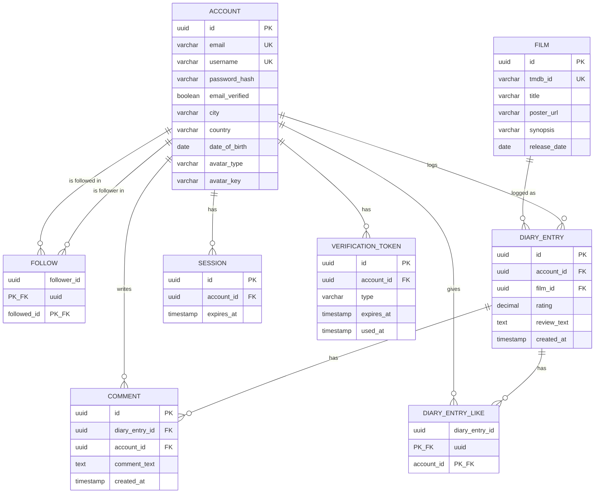

# Database ERD

Generated from `src/main/resources/db/migration/V1__INIT.sql`. Update this diagram whenever a new Flyway migration changes the schema.

## Notes

- `FOLLOW` and `DIARY_ENTRY_LIKE` are pure join tables with composite primary keys (both columns are `PK, FK` — marked `PK_FK` above since Mermaid doesn't support a comma inside a single key tag).
- `FOLLOW` has two relationships to `ACCOUNT` because it's self-referencing: one account can follow many accounts, and be followed by many accounts.
- `session` and `verification_token` are not yet backed by a JPA entity in the codebase (as of the current backlog) — this diagram reflects the DB schema, not the current entity layer.
